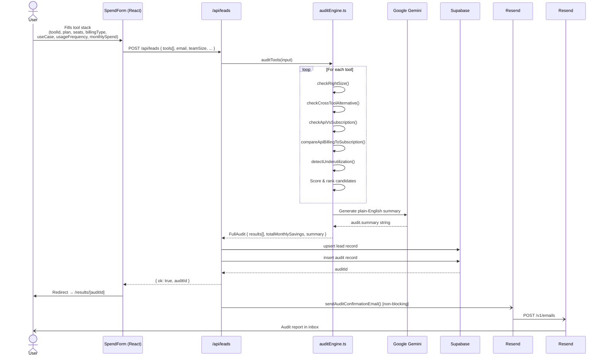
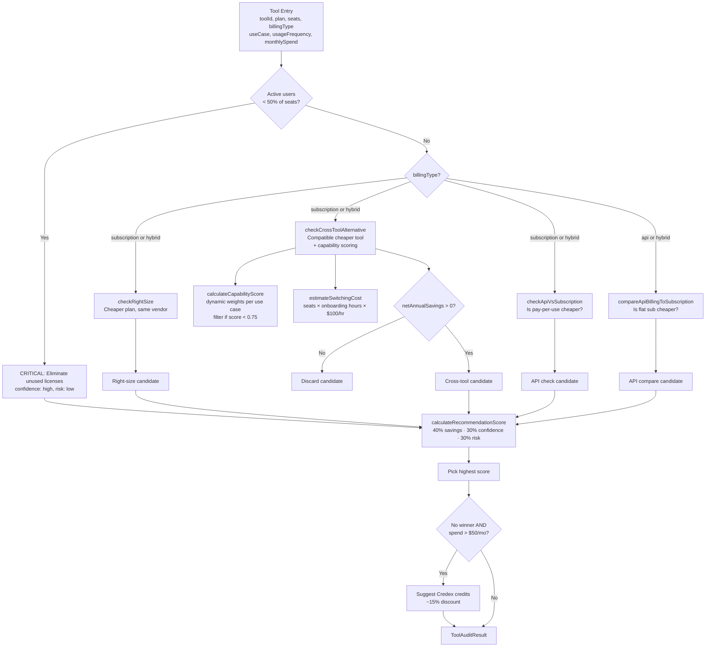
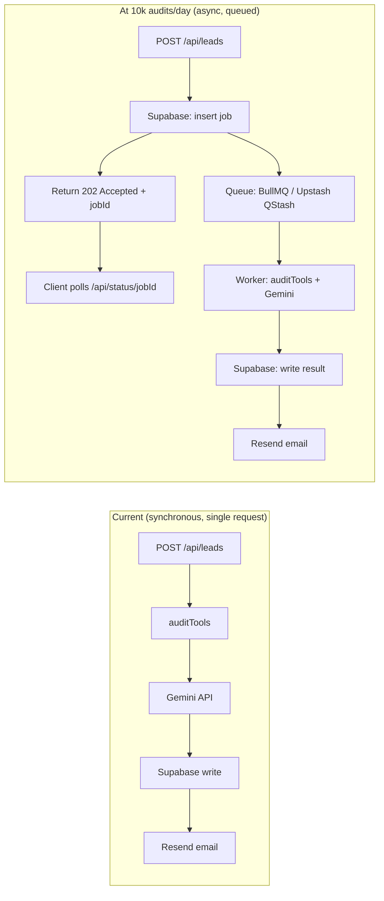

# 🏗️ SpendLens — Architecture

---

## System Diagram

```mermaid
graph TD
    User([👤 Startup Founder]) -->|Fills SpendForm| Form[SpendForm\nmulti-step React form]

    Form -->|POST tool stack + metadata| LeadsAPI[/api/leads\nNext.js Route Handler]

    LeadsAPI --> AuditEngine[auditEngine.ts\nauditTools function]
    LeadsAPI --> Supabase[(Supabase\nPostgreSQL)]
    LeadsAPI --> EmailService[email.ts\nnon-blocking]

    AuditEngine --> PricingData[pricingData.ts\ntool pricing + capabilities]
    AuditEngine --> GeminiAPI[Google Gemini\nAI Studio API]
    GeminiAPI -->|AI summary text| AuditEngine

    AuditEngine -->|FullAudit object| LeadsAPI
    Supabase -->|audit persisted| ResultsPage[/results/id\nNext.js Page]
    EmailService -->|audit report email| Resend[Resend API]
    Resend -->|inbox delivery| UserEmail([📧 User Inbox])

    User -->|visits shareable link| ResultsPage
    ResultsPage -->|fetch audit by id| AuditsAPI[/api/audits/id]
    AuditsAPI --> Supabase

    ResultsPage -->|generate preview| OGImage[/api/og/id\nOG Image]
```

---

## Data Flow — From Form Submission to Audit Result

Here is the full journey of a user's input through the system, step by step.



---

## Audit Engine Deep Dive

The core logic lives entirely in `src/lib/auditEngine.ts`. For each tool in the user's stack, it runs up to five checks, scores each candidate, and surfaces the single best recommendation.



---

## Why This Stack

| Decision       | Choice                    | Rationale                                                                                                                                                                                  |
| -------------- | ------------------------- | ------------------------------------------------------------------------------------------------------------------------------------------------------------------------------------------ |
| **Framework**  | Next.js 16 App Router     | Single repo for frontend + API routes. No separate backend needed for a form → audit → email flow. Turbopack makes dev fast.                                                               |
| **Language**   | TypeScript                | The audit engine has complex nested types (`AuditInput`, `ToolAuditResult`, `BillingType`). TypeScript caught several logic errors at compile time that would have been silent bugs in JS. |
| **AI summary** | Google Gemini (AI Studio) | Generous free tier, no credit card required for dev. The summary call is isolated to one function — swapping providers is a one-line change.                                               |
| **Email**      | Resend                    | Clean SDK, good deliverability, free tier covers demo usage. Non-blocking architecture means quota exhaustion never breaks the core audit flow.                                            |
| **Database**   | Supabase                  | Managed Postgres with a generous free tier. Row-level security and auto-generated REST API mean zero backend boilerplate for lead + audit persistence.                                     |
| **Styling**    | Tailwind CSS v4           | Fast iteration on form and results UI without context-switching to a separate stylesheet.                                                                                                  |
| **Testing**    | Vitest                    | Zero-config with Next.js + TypeScript. Fast enough to run in CI without a separate test server.                                                                                            |
| **Deployment** | Vercel                    | First-class Next.js support, environment variable management, preview deploys per PR.                                                                                                      |

---

## What Would Change at 10,000 Audits/Day

At current scale (demo / internship project), the app runs synchronously: the API route runs the audit, calls Gemini, writes to Supabase, and fires the email — all in one request. That breaks under load. Here is what would need to change.



Specific changes required:

**1. Async job queue**
Move `auditTools()` and the Gemini call off the request thread. Return a `202 Accepted` immediately with a `jobId`, then let a background worker (BullMQ on Redis, or Upstash QStash for serverless) process the audit. The client polls `/api/status/[jobId]` or uses a WebSocket/SSE for live updates.

**2. Gemini rate limit handling**
Google AI Studio has per-minute rate limits. At 10k/day (~7 audits/minute at even distribution, but bursty in practice), you hit them. Needs an exponential backoff retry wrapper and a fallback model (e.g. `gemini-flash` for summary, reserve `gemini-pro` for complex inputs).

**3. Supabase connection pooling**
Serverless functions open a new DB connection per invocation. At scale, connection exhaustion kills Supabase. Switch to [Supabase Pooler](https://supabase.com/docs/guides/database/connecting-to-postgres#connection-pooler) (PgBouncer) or use Prisma Accelerate.

**4. Pricing data caching**
`pricingData.ts` is currently a static import (in-memory). That's fine now. At scale, pricing needs a versioned cache layer (Redis or Supabase table) so pricing updates don't require a redeploy, and stale pricing warnings are accurate.

**5. Email delivery at volume**
Resend free tier caps at 3,000 emails/month (~100/day). At 10k audits/day, upgrade to a paid Resend plan or switch to AWS SES (roughly $0.10 per 1,000 emails). Also add a dead-letter queue for failed sends so no audit report is silently lost.

**6. Observability**
Add structured logging (Axiom or Datadog) with `auditId` as a trace key. Current `console.log` with `[EMAIL]` prefixes doesn't scale. Add p95/p99 latency tracking on the audit endpoint and Gemini call specifically — those are the two slowest operations.

---

## File Structure Reference

```
spendlens-app/
├── src/
│   ├── app/
│   │   ├── api/
│   │   │   ├── audits/[id]/route.ts    ← GET audit by ID
│   │   │   ├── leads/route.ts          ← POST lead + run audit
│   │   │   └── og/[id]/route.ts        ← OG image for sharing
│   │   ├── results/[id]/page.tsx       ← Shareable results page
│   │   └── page.tsx                    ← Landing + SpendForm
│   ├── components/
│   │   ├── SpendForm.tsx               ← Multi-step form
│   │   └── AuditResults.tsx            ← Results dashboard
│   └── lib/
│       ├── auditEngine.ts              ← Core 4-check audit logic
│       ├── pricingData.ts              ← Tool pricing + capabilities
│       └── server/
│           └── email.ts                ← Resend delivery (non-blocking)
├── public/
├── ARCHITECTURE.md                     ← This file
├── README.md
└── package.json
```
